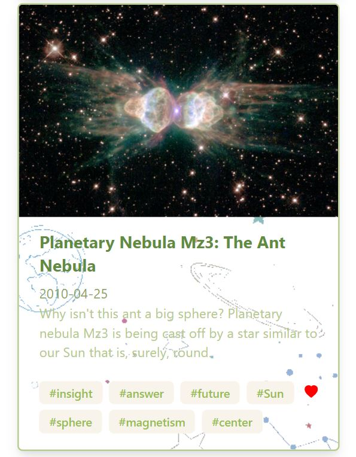

# Shopify **Frontend** Challenge

**[Live Demo](https://spacestagram-shopify.herokuapp.com/)** *<- hosted on heroku*

Features Implemented
- *Animated* **loading state** while images are being fetched
- **Shopify** design **colors** from **[www.shopify.com](https://www.shopify.com/)** 
- Custom *space-themed* **background-graphics** for **image cards** I designed with **LunaPic** editor
- Custom **AI-based Keyword Image Tagging API (#)** I built with **Flask**, **[spaCy NLP library](https://spacy.io/usage/linguistic-features)**, and deployed on **GCP**
- Press the ***little heart*** (bottom-left-corner) to like the image

Extra Note (Keyword Image Tagging)
- Since Nasa has currently disabled their **concept_tags** parameter on the **APOD API** which provides useful **image tags**, I decided to build my own **keyword tagging API** to do such. 
- I used **spaCy** **NLP** speech tagging library in **Python** and deployed the endpoint with **Flask** via **GCP**. (Javascript itself doesn't have great NLP capabilities!).
- **Directory:** `./microservice/` (**keyword tagging API** that I put together)

Extra Note (Video)
- I **filtered out** all **API responses** from **NASA APOD** with the `media_type` parameter of `video` for **simplicity**

Extra Note (Mishaps that I made along the way which I later ***fixed***)
- I didn't realize that most browsers have a **URL character limit** and I sent data to my **Keyword parsing API** through **URL params** with **GET** requests. Fixed with **POST** request.
- I initially didn't have **CORS** set up on my **Keyword parsing API**. Since my **client side** and **API** are hosted on different ports, this was a problem. 
- I didn't notice that *one* of my function calls made use of a React **state** parameter (which is **async**) instead of the response parameter. This left me confused for quite some time.

