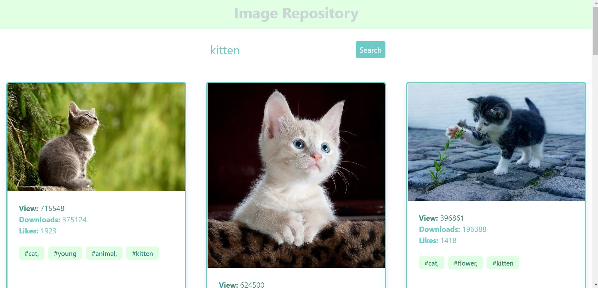

# Shopify **Backend** Challenge

**[Live Demo](https://spacestagram-shopify.herokuapp.com/)**

Description of Image Repository
- Image repository that pulls images and data from the **Pixabay API**
- **Search functionlity** allows user to search for different images based on image characteristics
- **Descriptive** elements including how many time each image is **liked**, **downloaded**, or **viewed** are pulled from **Pixabay** and displayed
- **Image tags** are pulled from **Pixabay** and displayed

