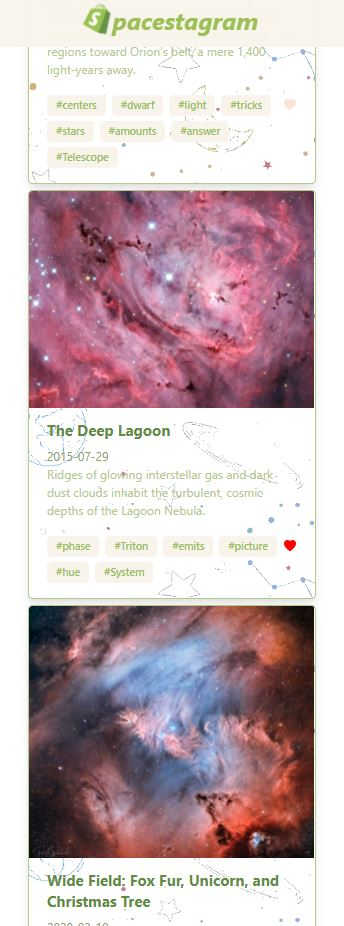

# Shopify **Frontend** Challenge

**[Live Demo](https://spacestagram-shopify.herokuapp.com/)**

Features Implemented
- **Loading** state while images are being fetched
- **Shopify** design theme from **[www.shopify.com](https://www.shopify.com/)**
- **Image Tagging (#)** with NLP **[spaCy](https://spacy.io/usage/linguistic-features)** library 

Extra Note (Image Tags)
- Since Nasa disabled their **concept_tags** parameter on the **APOD API** which provides useful **image tags**, I decided to build my own **API** to do such. 
- I used **spaCy** **NLP** speech tagging library in **Python** and deployed the endpoint with **Flask**. (Javascript doesn't have great NLP capabilities!).
- I left **this** feature **local** because of the extra **latency** and **risk** of the backend **crashing** which I *occasionally* experienced with the live version.
- Instead, the **live** demo makes use of a simpler tagging technique 
- **Directory:** `microservice/app.py` (Custom **API** I built)

Extra Note (Video)
- I **filtered out** all **API responses** from **NASA APOD** with the `media_type` parameter of `video` for **simplicity**

